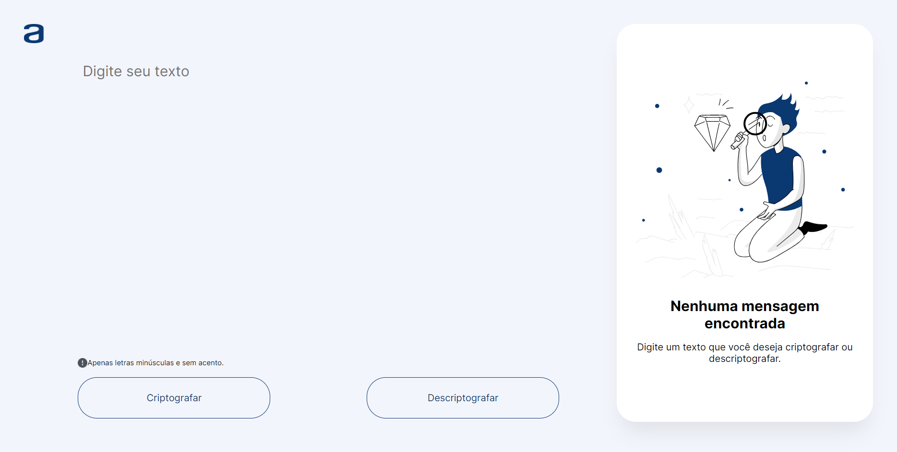

# Challenge Alura - Decodificador

## Tecnologias Utilizadas

- HTML (puro)
- CSS (puro)
- JavaScript (puro)

## Descrição do Projeto

Este projeto consiste em uma aplicação web para criptografar e descriptografar textos, permitindo a troca de mensagens secretas entre usuários que compartilham o conhecimento das regras de criptografia utilizadas.

### Regras de Criptografia:

**1. Letras Minúsculas Apenas:**

O sistema funciona exclusivamente com letras minúsculas. Certifique-se de inserir apenas caracteres neste formato.

**2. Chaves de Criptografia:**

- 'e' é convertido para 'enter'
- 'i' é convertido para 'imes'
- 'a' é convertido para 'ai'
- 'o' é convertido para 'ober'
- 'u' é convertido para 'ufat'

**3. Sem Acentos ou Caracteres Especiais:**

Não utilize letras com acentos nem caracteres especiais. A aplicação se baseia apenas em caracteres alfabéticos simples.

**4. Conversão Bidirecional:**

É possível converter uma palavra para a versão criptografada e, da mesma forma, retornar uma palavra criptografada para a versão original.

## Acesso ao Projeto

Você pode acessar o projeto através do GitHub Pages [aqui](https://apenasumsonhador.github.io/Challenge-Alura---Decodificador/).

## Instalação

1. Clone o repositório: `git clone https://github.com/ApenasUmSonhador/Challenge-Alura---Decodificador`
2. Abra o arquivo `index.html` em seu navegador.

## Uso

**1. Acesse a Aplicação:**

Abra o arquivo HTML no seu navegador ou hospede a aplicação em um servidor web.

**2. Entrada de Texto:**

Insira o texto desejado na área de entrada. Certifique-se de seguir as regras de letras minúsculas e ausência de acentos.

**3. Escolha Criptografar ou Descriptografar:**

Selecione a opção desejada para criptografar ou descriptografar o texto inserido.

**4. Visualize o Resultado:**

O resultado será exibido na seção de saída. Se estiver criptografando, a palavra será convertida; se estiver descriptografando, a palavra original será revelada.

**5. Botão de Cópia (Extra):**

Utilize o botão "Copiar" para copiar o texto criptografado/descriptografado para a área de transferência, facilitando o compartilhamento.

## Contribuição

Contribuições são bem-vindas! Caso queira contribuir com este projeto, siga as etapas abaixo:

1. Faça um fork do projeto
2. Crie uma nova branch: `git checkout -b minha-nova-feature`
3. Faça commit das suas alterações: `git commit -m 'Adicione uma nova feature'`
4. Faça push para a branch: `git push origin minha-nova-feature`
5. Abra um pull request

## Licença

Este projeto está licenciado sob a [Licença MIT](LICENSE).

